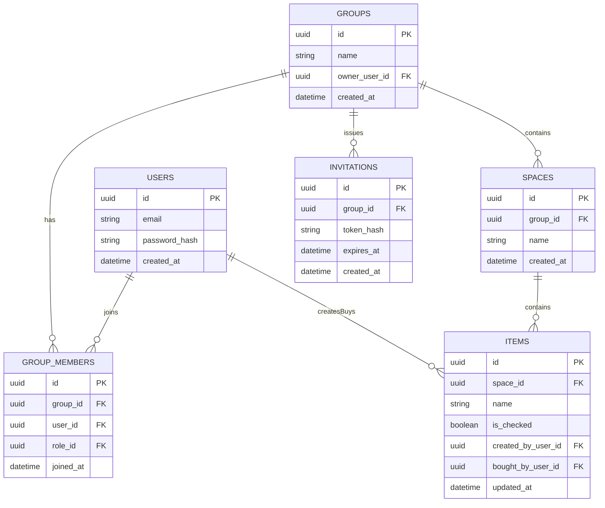
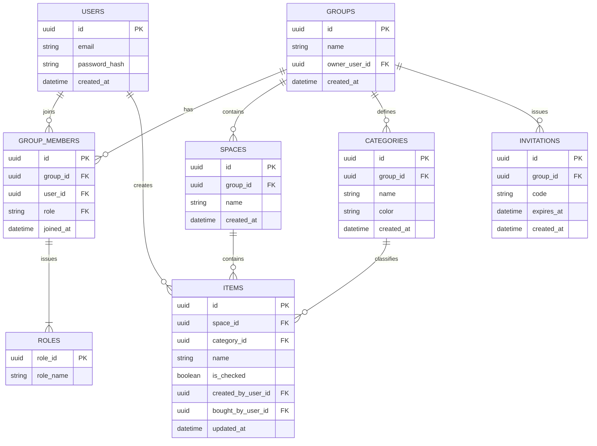

- 認証は個人のみ
- 招待リンクから誰でも参加可能
- 招待コードは変わる（有効期限1時間）
- MVPからは外したけど、後からメンバー追放追加したい（ロール持たせる？）
- 商品カテゴリもMVPからは外したけど、グループごとのカテゴリを持たせるようにしたい

**mermaid表示には拡張機能必要**

### 最低限

- メンバー追放機能追加する（ロール持たせる）
- グループごとのカテゴリを持たせるようにしたい

